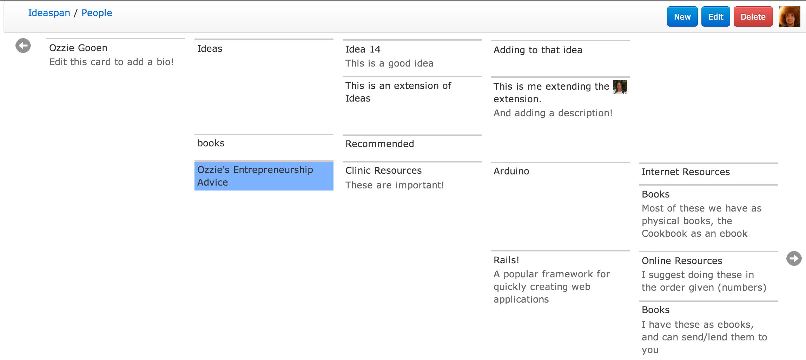

#Wikimap.  Dynamic Social Tree of Text Snippets
Wikimap is a map of text snippets with titles and descriptions.  They
are extremely general and created for sharing between large networks
of people.  I created this a few months before I found out about
workflowy, which is similar in structure.  

##Try Wikimap
Try it [here](http://ideaspan.herokuapp.com/). Once you begin, you
will start out in with one basic node, which is connected to the rest
of the entire map.  You may want to click the header to go back to the
main map, and work from there.

## Using Wikimap
Wikimap was created to be worked with easily and efficiently.  It
consists of a collection of editable cards, each with a title and
description.  You can create cards anywhere in the complete graph,
but you can only edit or delete cards that you have created.  There
are several key bindings to move around the map with great ease.    

###Keys

+ E: Edit Card
+ N: New Card
+ D: Delete Card
+ Up Arrow: Move up one card
+ Down Arrow: Move down one card
+ Left Arrow: Move left one card
+ Right Arrow: Move right one card

###Login
The app uses facebook login, then imports pictures from Facebook.
 

There are some arrows to either the right or left for cards at the end
of the page.  These signify that there are additional cards at that
end, which you can get to be moving to that position.

##License
The MIT License (MIT).

All code is under the MIT License. Copyright (c) 2013 Ozzie Gooen
